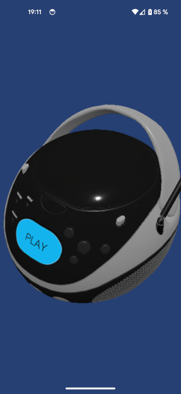

# Expo + React Native WebGPU + Babylon Lite

## Setup

```bash
npx create-expo-app@latest --template blank-typescript
npx expo install react-native-webgpu expo-build-properties
npm install @babylonjs/lite
```

Add these plugins to `app.json`:

```json
"plugins": [
  "react-native-webgpu",
  [
    "expo-build-properties",
    {
      "android": {
        "minSdkVersion": 26
      }
    }
  ]
]
```

Then prebuild and run:

```bash
npx expo prebuild
npx expo run:android   # or: npx expo run:ios
```

### Expected Output


